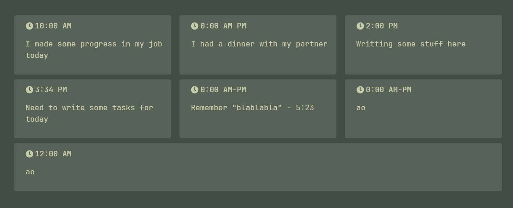

# Bin Utils

Just an obsidian plugin that I made in just a few hours...


## Features

### Raw file to multi-column

I had a problem journaling in obsidian, I can't wait for the large load time in Android, so I made a
"raw file" when you only need to use text and the hour

Quick example:
This could be a normal file which I use to write in my phone

```
I made some progress in my job today - 10:00 AM

I had a dinner with my partner

Writting some stuff here - 2:00 PM

Need to write some tasks for today - 3:34 PM

Remember "blablabla" - 5:23

ao

ao - 12:00 AM
```

Now after the process command:

